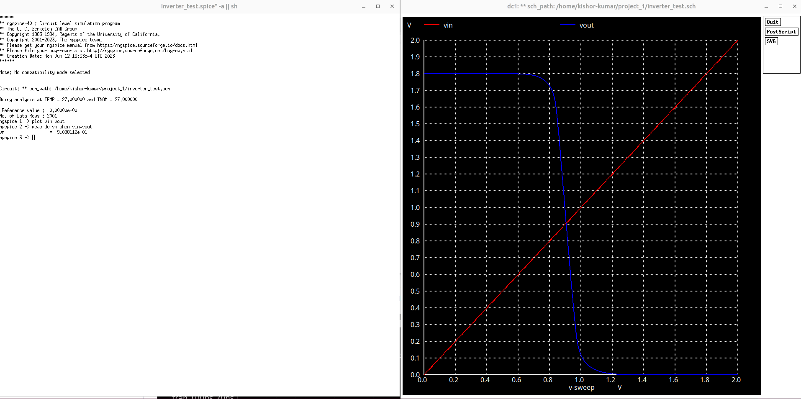

# Inverter-Design-and-Analysis-using-sky130pdk
### Design and Analysis of CMOS Inverter using the sky130 pdk and various open source tools
---

This project has only one motive; that is to experiment with working of an inverter and understanding all the parameters involved with it. The design will utilise the models that are present under the __skywater 130nm pdk__ and various open source tools such as, __Xschem__, __NGSPICE__, __MAGIC__, __Netgen__, etc.

The whole process starts with analysis of _NMOS_ and _PMOS_ devices, specifically the 1.8v standard models available inside the pdk to determine a common working W/L ratio and also the gm, ron and similar values. After this we start with the design of a CMOS inverter that includes schematic, measurement of various parameters like delays, noise margin, risetime, falltime, etc. This part would also act as a case study on __SPICE__ where we use it's programming capabilities to better our abilities in measurements of aforementioned parameters. Then we will engage in the design a layout for our inverter in __magic layout editor__. Here, we will also explore the different layers available to the user and how we utilise them in a design and what it translates to in terms of a mask. Lastly, we compare the two netlists, that is the schematic and the layout one, which is popularly referred to as ___LVS___. If everything is hunky-dory, this project would then conclude. 

I will try to keep updating it as often as possible, as this first project is a primary resource for me to practice analog design, with the open source toolchain and definitely to keep a documentation that is easily understandable by anyone who later tries to practice it the same way.

Let's get right into it. 

## 2. Analysis of MOSFET models

### 2.1 General MOS Analysis

In this section I start with our analysis of MOSFET models present in sky130 pdk. I would be using the 1.8v transistor models, but you can definitely use and experiment with other ones present there. below is the schematic I created in **Xschem**.

___highly recommended to check out the tutorials of xschem [here](http://repo.hu/projects/xschem/xschem_man/xschem_man.html) and ngspice [here](http://ngspice.sourceforge.net/docs/ngspice-manual.pdf)___


The components used are:<br>
```nfet_01v8.sym``` - from xschem_sky130 library<br>
```vsource.sym``` - from xschem devices library<br>
```code_shown.sym``` - from xschem devices library<br>

I used the above to plot the basic characteristic plots for an NMOS Transistor, That is ___Ids vs Vds___ and ___Ids vs Vgs___. To do that, just save the above circuit with the above mentioned specifications and component placement. After this just hit __Netlist__ then __Simulate__. ___ngspice___ would pop up and start doing the simulation based calculations. It will take time as all the libraries need to be called and attached to the simulation spice engine. Once that is done, you need to write a couple commands in the ngspice terminal:<br><br>
```display``` - This would display all the vectors available for plotting and printing.<br>
```setplot``` - This would list all the set of plots available for this simulation.<br>
_after this choose a plot by typing '''setplot <plot_name>'''. for example '''setplot tran1'''_<br>
```plot``` - to choose the vector to plot.<br>
_example : plot -vds#branch_<br><br>

Then you must see the plot below you, if you did a DC sweep on the __VGS__ source for different values of __VDS__:<br>
<br><br>

This definitely shows us that the threshold value is between __600mV to 700mV__ .
Similarly, when I sweep __VDS__ source for different values of __VGS__, I get the below plot:<br>

<br><br>

Now the above two definitely looks like what the characteristics curves should, but now we need to choose a particular curve that we would do further analysis on.

I also did plot gm and go(or ro) values for the above mosfet. This would be crucial as we can obtain a lot of parameters from these values. Both of these below are for the general dc sweep we did above. 
<br>
<br>

## 3. CMOS Inverter Design and Analysis
### 3.1 Why CMOS Circuits

An interesting obseration was made in the previous section, where we realised that neither NMOS nor PMOS can be used for design that can produce either values, HIGH and LOW. But another thing that is worth notice is how they complement each other. This is what gave rise to an idea of attaching them together. Since, __PMOS__ is a __Strong 1__, we put it between VDD and Vout and __NMOS__ being a __STRONG 0__, it is placed between Vout and GND. This way, either can act as a load to the other transistor, since __both are never ON together__ (Are they?). The configuration looks like what we have below. This is referred to as __Complimentary Metal Oxide Semiconductor__(CMOS) Configuration and it also represents the simplest circuit known as the __CMOS Inverter__.<br><br>

CMOS Circuits generally consists of a network split into two parts, Upper one referred to as a __pull up network__ and the lower half as a __pull down network__. The former consists of P-channel MOSFETs and later N-Channel MOSFETs. Reason is simple. As one transistor is one, another is off. This eliminates the issue of an resistive path to the ground and hence, no voltage division occurs(At least not a significant one). This way, one can easily achieve a Strong High and a Strong LOW from the same network. __PULL UP__ is what offers a low resistance path to the VDD and __PULL DOWN__ is what offers a low resistance path the GND.

<br>

### 3.2 CMOS Inverter Analysis Pre-Layout

Before, I start with the CMOS inverter,  I believe it is worth mentioning what an Inverter is. Inverter is something that inverts. In electronics it is very popularly explained as something that performs the __NOT__ logic, that is complements the input. So a __HIGH(1.8V)__ becomes __LOW(0V)__ and vice versa. Ideally, the output follows the input and there is no delay or propogation issues of the circuit. But in reality, an inverter can be a real piece of work. It can have serveral isseus like how fast can it react to the changes in the input, how much load can it tolerate before it's output breaks and so many more including noise, bandwidth, etc.

All these parameters are what will always plague any analog design or design with transistor in general. Hence, with inverter many like to explore them all. So it justifies why Inverter is referred to as ___Hello World! of transistor level design___. Atleast, I say that :rofl:. So in this section that took me aeons to reach to, we finally start with all the important analysis and parameters to be evaluated for an Inverter. I first start with a schematic diagram, then I evaluate all the parameters, that is, measuring them, experimentin with them and reaching a conclusive value and Finally reach a schematic circuit that is capable of things we lay down at the beginning.

So I designed a Schematic of the Inverter, where the whole thing is based on what we determined earlier. I have chosen __(W/L) of PMOS = 4 times (W/L) of NMOS__ and __(W/L) of NMOS is 1/0.30 in microns__. I also designed a symbol of it, so that we can utilise that for further schematic creation.<br><br>
<br>

A lot of calculations will now start from this point. Similar to how we analysed for MOSFETs individually. Also from now on, ___(W/L)___ would be mentioned as ___S___ or ___Aspect Ratio___ Simply. We would use the following testbecnch for future analysis.(Transient and DC)<br>
<br>

#### 3.2.1 DC Analysis and Important design parameters

DC analysis would be used to plot a Voltage Transfer Characteristics (VTC) curve for the circuit. It will sweep the value of Vin from high to low to determine the  working of circuit with respect to different voltage levels in the input. The following plot is observed when simulated :<br>


A voltage transfer characteristics paints a plot that shows the behavior of a device when it's input is changed(full swing). It shows what happens to the output as input changes. In our case, for an inverter we can see a plot that is like a square wave(non ideal), that changes it's nature around 0.75 volts of input. So one can say that there are like 3 regions in the VTC curve, the portion where output is high, the place of transistion and the one where the output goes low. But actually there are __five regions of operation__ and they are based on the working of inverter constituents, that is the NMOS and the PMOS transistors with respect to the change in the input potential. <br>


One can solve for them using the equations for individual transistors. Now it is time to talk about the important parameters of this device that are based off it's VTC curve.
- __VOH__ - Maximum output voltage when it is logic _'1'_.
- __VOL__ - Minimun output voltage when it is logic _'0'_.
- __VIH__ - Maximum input voltage that can be interpreted as logic _'0'_.
- __VIL__ - Minimum input voltage that can be interpreted as logic _'1'_.
- __Vth__ - Inverter Threshold voltage

Above five are critical for an Inverter and can be seen on the __VTC__ curve of an inverter. One thing to point out now would be,
<p align=center><i><b>Vth should be at a value of VDD/2 for maximum noise margins</b></i></p> 

And I tried to do that with our calculated inverter values at __l=300nm__ but guess what! It did not work at all. I know there has to be a reason for it, which I will try to investigate further, but as of now, I changed the device parameters to get __Vth__ close to the values __Vdd/2__. Now our __NMOS has S = 1.05/0.15__ and __PMOS has S = 2.1/0.15__. Below is it's simulation result using the same testbench.<br>
<br><br>

__VOH__ and __VOL__ are easy to determine as they are your aboslute values. In our case it is __1.8V__ and __0V__ respectively. For __Vih__ and __Vil__, we have another method. At __Vin__ = __VIH__, NMOS is in Saturation region and PMOS in Linear; while when __Vin__ = __VIL__, NMOS is in Linear and PMOS in Saturation. Another interesting thing about these points is that, _these are the points on the curve, when the magnitude of slope = 1_. So we can use ```measure``` commands to find them on the plot. In the plot shown below, look at the points that are at the intersection of the vout curve and the blue vertical line. These are our __VIH__ and __VIL__.<br>
<br><br>And to calculate them, we use ```.meas``` statement with apt instructions. The result is down below.<br>
<br><br>

Look at the commands used carefully. The first lines declares a function, that I have used to see at what region is the derivative of Vout with respect to Vin greater than or equal to one. This has no significance other than visualizing what region is the one where transition occurs. After this I set the plot to dc1, which is the identifier for the first dc analysis done for the netlist. Then it was just plotting them all and using the measure statements to determine the values necessary.

Let's summarize the values obtained :
| Voltage | Value |
|---------|-------|
| Vth_inv | 0.91V |
|   VOH   | 1.8V  |
|   VOL   |  0V   |
|   VIH   |  1V   |
|   VIL   | 0.78V |

Now all the basic defining characteristics of an inverter are done. So we can find a couple more things and then proceed towards the transient analysis. Next is __Noise Margins__. Noise margins are defined as the range of values for which the device can work noise free or with high resistance to noise. This is an important parameter for digital circuits, since they work with a set of specific values(2 for binary systems), so it becomes crucial to know what values of the voltages can it sustain for each value. This range is also referred to as __Noise Immunity__. There are two such values of Noise margins for a binary system:<br>
<b>NML(Noise Margin for Low) - VIL - VOL</b><br>
<b>NMH(Noise Margin for HIGH) - VOH - VIH</b><br>

So for our calculated values, the device would have, __NML = 0.78V__ and __NML = 0.8V__.

#### 3.2.1 DC Analysis and Important design parameters

Transient analysis of a circuit is the simulation of the circuit's electrical behaviour over time, specifically its response to changing input signals. The CMOS inverter dynamic characteristics are shown below. So, some of the following formal definitions of different parameters are discussed below. Here, all the percentage (%) values are the steady-state values :<br>

Rise Time or tr: Rise time is the time used to increase the signal from 10% to 90%. Fall Time or tf: Fall time is the time used to drop the signal from 90% to 10% Edge Rate or trf : It is (tr + tf )/2. The propagation delay from high to low or tpHL: The time used to drop from VOH – 50%. The propagation delay from low to high or tpLH: The time used to increase from 50%- VOL. Propagation Delay or tp: It is (tpHL + tpLH)/2. Contamination Delay or tcd: It is the smallest time from the 50% input crossing to the 50% output crossing.<br>

The transfer characteristics for the transient analysis for is given below:<br>


Three golden methods to increase speed of the inverter (rise time reduction) :

🔸Increase W/L ratio: More W/L = more current = faster load capacitance charging.

🔸Increase power supply (Vdd): Higher Vdd = higher current flow = faster load capacitance charging.

🔸Reduce load capacitance: Less capacitance = quicker charging = faster circuit response.


Now we consider a load capacitance at the output of our invertor. The value of the capacitance we consider is 0.5pF. For unloaded inverters, doubling the sizes of the NMOS and PMOS doesn't have much effect on rise time. For a loaded inverter, it will have an effect. We will look into how much effect that will have by taking the Widths to be 4,1 in the first case.<br>


